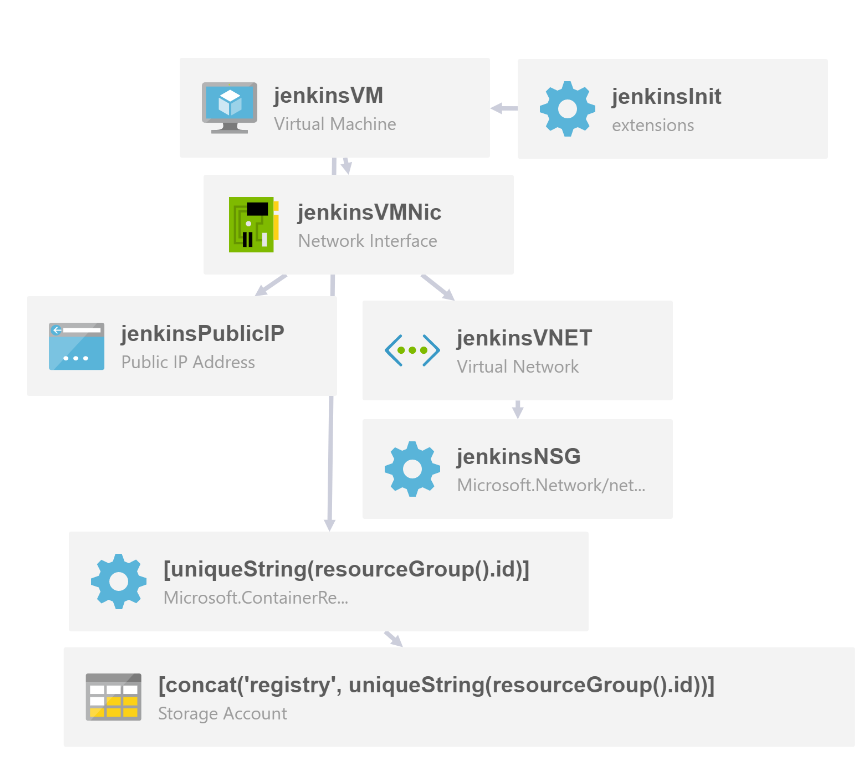

# Verbosity between ARM and Terraform - side by side

This repo is entirely written for an example between IAC with Terraform and ARM templates.

## Stack details

We will see a DEMO infrastructure with following components:

- Azure Container Registry
- Storage Account
- Public IP Address
- Network Security Group
- Virtual Network (with Subnet)
- Network Interface Card (NIC)
- Virtual Machine (with VM Extension)

### Diagram of the stack

## Azure Examples

Examples are taken from [Azure quick start templates](https://github.com/Azure/azure-quickstart-templates) repository.

 - [Jenkins + Azure Container Registry](https://github.com/Azure/azure-quickstart-templates/tree/master/201-jenkins-acr)

# Conclusion

This is 63 lines of code, which is a pretty massive improvement over the original ARM template (294 lines). This means reading (and more importantly, understanding) what is going on in this configuration requires much less scrolling.

Also, the fact that this is now split into smaller pieces and that everything is parameterized, makes it easier to maintain and more adaptable to changing requirements (and remember, the only constant is change).
